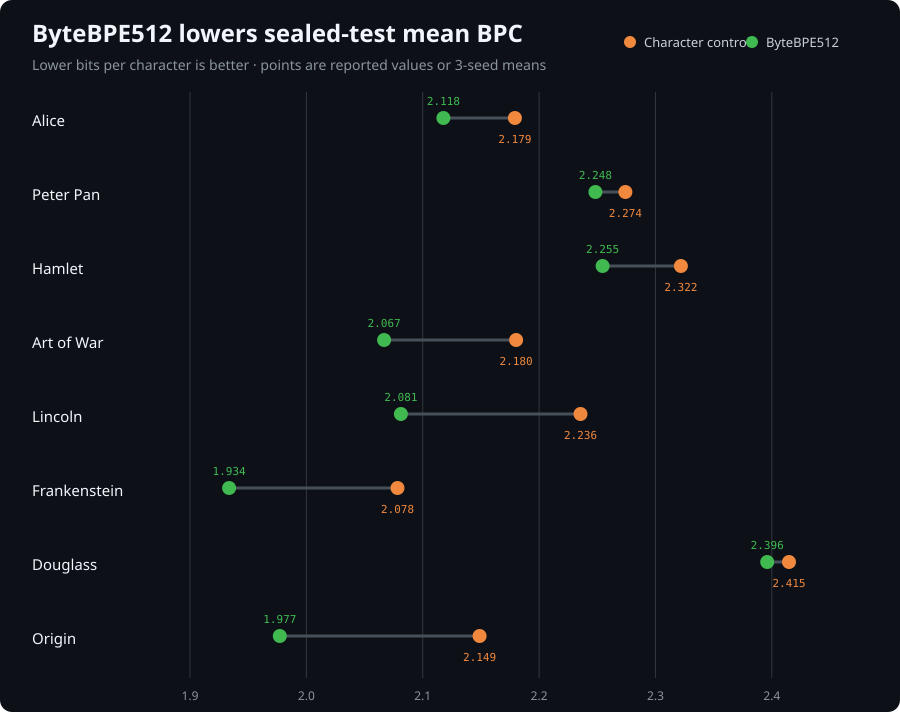
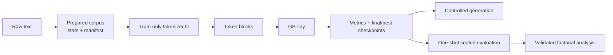

# smaLLM

[](https://github.com/almondsun/smallm/actions/workflows/ci.yml)
[](pyproject.toml)
[](LICENSE)

`smaLLM` is a small, reproducible GPT-style language-model lab built from scratch in PyTorch. It
connects the full research-engineering path: corpus provenance, character and educational BPE
tokenizers, causal Transformer modeling, controlled training and generation, sealed evaluation,
and candid experiment reports.

This is an inspectable learning and research artifact, not a competitive or production language
model.



## What This Demonstrates

- **Model engineering:** decoder-only Transformer blocks, causal multi-head attention, next-token
  loss, AdamW training, checkpoint selection, and controlled sampling.
- **Reproducible systems:** config snapshots, corpus checksums, dataset manifests, bounded artifact
  readers, run discovery, exact evaluation coverage, and deterministic seeds.
- **Experimental discipline:** baselines, corrected metric contracts, multi-seed controls,
  preregistration, one-shot sealed tests, and explicit negative results and limitations.
- **Software quality:** strict mypy, Ruff, branch coverage above 90%, dependency auditing, CodeQL,
  dependency review, and pinned GitHub Actions.

## Results at a Glance

The main finding is narrow and repeatable: boundary-aware ByteBPE512 achieved lower mean
sealed-test bits per character (BPC) than the declared character control on eight English
public-domain corpora. Lower BPC is better.

| Corpus | Character BPC | ByteBPE512 BPC | Difference |
| --- | ---: | ---: | ---: |
| Alice | 2.1792 | **2.1178** | -0.0614 |
| Peter Pan | 2.2742 | **2.2484** | -0.0258 |
| Hamlet | 2.3219 | **2.2546** | -0.0673 |
| Art of War, 3-seed mean | 2.1802 | **2.0668** | -0.1134 |
| Lincoln, 3-seed mean | 2.2356 | **2.0813** | -0.1543 |
| Frankenstein, matched char136, 3-seed mean | 2.0783 | **1.9336** | -0.1447 |
| Douglass, matched char136, 3-seed mean | 2.4148 | **2.3960** | -0.0187 |
| Origin, matched char136, 3-seed mean | 2.1489 | **1.9772** | -0.1717 |

The final preregistered capacity-controlled panel matched char136 within 0.40% of ByteBPE512's
parameter count. ByteBPE512 won eight of nine matched same-seed comparisons and all nine
comparisons with the historical char128 arm. The directional hypothesis succeeded on every corpus,
but a +0.0018 BPC Douglass reversal and strongly corpus-dependent effects rule out a universal
claim.

The structured chart data is in [`results/sealed_test_bpc.json`](results/sealed_test_bpc.json).
Detailed claims, all 27 observations, checkpoint hashes, controls, and limitations are in
[`experiment 030`](experiments/030-final-capacity-panel-and-project-completion.md) and
[`results/final_capacity_panel.json`](results/final_capacity_panel.json). Historical experiments
016–017 use a superseded evaluation contract and retain explicit errata.

## Five-Minute CPU Demo

The demo uses a small synthetic corpus committed with the repository. It validates the entire
artifact flow; five training steps are intentionally too few to demonstrate language quality.

```bash
git clone https://github.com/almondsun/smallm.git
cd smallm
python -m pip install -e ".[dev]"
make demo
```

The command prepares and hashes the corpus, trains a tokenizer, evaluates simple baselines, trains
a smoke model, prints the resulting run record, and performs deterministic generation. Generated
data, tokenizers, checkpoints, and runs stay in ignored local directories.

For the real-corpus workflow and every individual command, see
[`docs/training.md`](docs/training.md).

## Reviewer Paths

- **Research design:** start with
  [`experiment 030`](experiments/030-final-capacity-panel-and-project-completion.md), then inspect the
  chronological [`experiment index`](docs/experiments.md).
- **Architecture:** read [`docs/architecture.md`](docs/architecture.md), then
  [`src/smallm/model/`](src/smallm/model/) and
  [`src/smallm/training/`](src/smallm/training/).
- **Data and safety contracts:** inspect [`src/smallm/data/`](src/smallm/data/),
  [`src/smallm/evaluation/`](src/smallm/evaluation/), and the focused [`tests/`](tests/).
- **Theory:** the [`notes/`](notes/) handbook derives the objective, attention, tokenization,
  BPC, decoding, provenance, and experiment design alongside implementation links.

## Architecture



Reusable tensor, data, evaluation, generation, and artifact behavior lives under `src/smallm/`.
Scripts remain thin orchestration adapters, and filesystem writes stay outside model code.

## Current Capabilities

| Area | Implemented contract |
| --- | --- |
| Corpus preparation | Normalization, source metadata, statistics, checksums, and compatible manifests |
| Tokenization | Character, educational character-BPE, and lossless boundary-aware UTF-8 ByteBPE |
| Model | Decoder-only GPT with learned positions, pre-norm blocks, causal attention, and GELU MLPs |
| Training | Config-driven AdamW, full or sampled validation, early stopping, final/best checkpoints |
| Evaluation | Uniform/unigram/bigram baselines, exact BPC, sealed tests, balanced matrix validation |
| Artifacts | Config, metrics, summary, checkpoints, sample, manifest, environment, and identities |
| Generation | Greedy or seeded sampling with explicit temperature, top-k, and token budget |

## Reproduce and Validate

Use the frozen development environment when `uv` is available:

```bash
uv sync --frozen --extra dev
uv run make check
uv run make audit
```

`make check` runs formatting verification, lint, strict type checking, tests with branch coverage,
compile checks, and Markdown link validation. The canonical command matrix is documented in
[`docs/codex/build-and-test.md`](docs/codex/build-and-test.md).

## Scope and Limitations

- Models are intentionally tiny and trained on individual public-domain documents.
- Reported seeds and corpora are fixed experimental panels, not population samples.
- Chronological validation and test regions can differ materially in difficulty.
- Tokenizers predict different units, so cross-tokenizer comparisons use exact character-normalized
  BPC rather than token loss or perplexity.
- Runtime corpora and checkpoints are not distributed; reports preserve commands, identities, and
  aggregate evidence without committing generated text or large local artifacts.
- The tokenizer is educational rather than a production replacement for established libraries.

## Project Status

Version `1.0.0` is the permanent completion release. The declared implementation and research
scope is finished; no additional features, experiments, dependency refreshes, or compatibility
work are planned. CI remains available on pushes and pull requests, and the repository stays open
for inspection and discussion without a maintenance or response commitment. See
[`Project Completion`](docs/project-completion.md) for the frozen-but-open policy.

Security and artifact-handling expectations are in [`SECURITY.md`](SECURITY.md). The project is MIT
licensed and provides [`CITATION.cff`](CITATION.cff) metadata; forks may continue independently.
