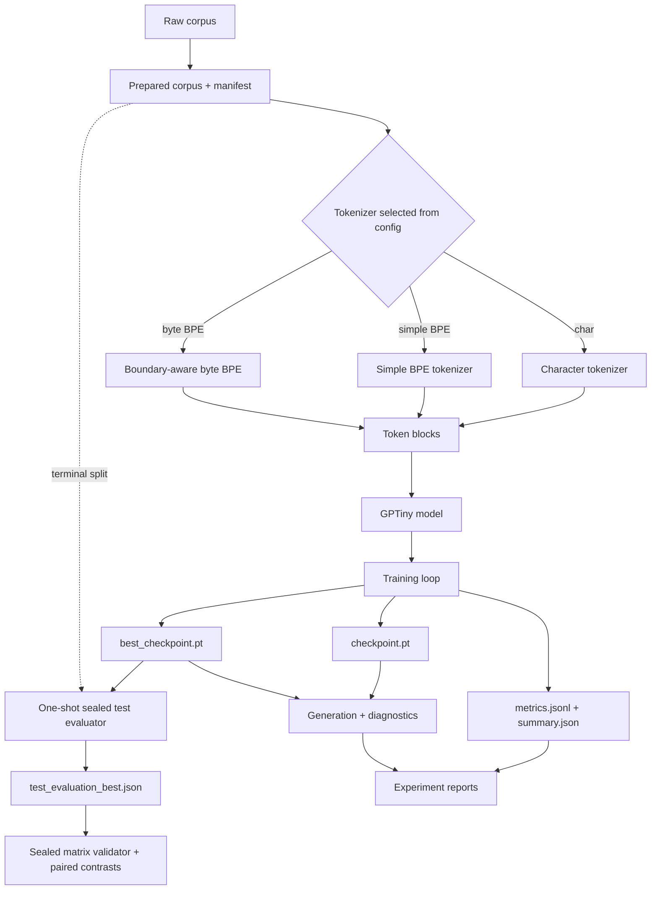

# Architecture

`smaLLM` is organized as a small PyTorch package with scripts at the edge. The
main design rule is that reusable behavior lives under `src/smallm/`, while
scripts parse arguments and call package code.

## Model Path

## Module Boundaries

`data/` owns corpus normalization, manifest fields, tokenizer state, and token
block construction.

`model/` owns the GPT network: embeddings, causal self-attention, Transformer
blocks, final normalization, and language-model head.

`evaluation/` owns simple reference models, bounded run observations, and shared evaluation
contracts used to interpret validation and sealed-test loss.

`training/` owns orchestration: dataloaders, optimization, evaluation intervals,
progress logging, checkpoints, run directories, metrics, summaries, and copied
dataset manifests.

`generation/` owns decoding from a trained model, including temperature, top-k,
seeding, and greedy mode.

`utils/` owns small runtime helpers such as device and seed selection.

## Data Contracts

Corpus preparation writes:

| File | Purpose |
| --- | --- |
| `data/processed/corpus.txt` | Normalized text used by tokenizer prep, baseline evaluation, and training. |
| `data/processed/corpus_stats.json` | Character counts, split counts, line counts, and frequency summaries. |
| `data/processed/corpus_manifest.json` | Source metadata, checksums, paths, counts, split settings, and normalization rules. |

Training copies the manifest into the run directory and stores selected dataset
identity fields in `summary.json`.

## Model Components

The GPT model is decoder-only:

- token embedding
- learned position embedding
- dropout
- repeated Transformer blocks
- final layer norm
- linear language-model head

Each block uses pre-norm residual attention and a GELU MLP. Attention uses a
lower-triangular causal mask so position `t` cannot attend to future tokens.

The forward pass returns logits and, when targets are provided, next-token
cross-entropy loss.

Tokenizer fitting uses training text only. Validation traverses deterministic non-overlapping
blocks and weights NLL by target count; summaries disclose full or sampled coverage. Byte BPE uses
a complete UTF-8 byte fallback, forbids merges across whitespace boundaries, and preserves aligned
Unicode-character completion counts for exact BPC.

An optional explicit validation fraction activates a chronological train/validation/test split.
Training does not encode the terminal test text. After checkpoint selection, the sealed evaluator
verifies corpus and checkpoint identity, evaluates full coverage once, and refuses to overwrite its
result artifact.

For balanced panels, `sealed_matrix.py` reads only bounded run artifacts and refuses incomplete,
duplicated, incomparable, identity-invalid, or partially evaluated cells before computing paired
tokenizer effects and corpus interactions. The CLI remains a thin adapter.

## Run Artifacts

Each training run writes:

| File | Purpose |
| --- | --- |
| `config.yaml` | Exact config snapshot. |
| `metrics.jsonl` | Step-level training and validation metrics. |
| `summary.json` | Versioned losses, exact validation coverage, paths, parameter count, dataset identity, and generation settings. |
| `checkpoint.pt` | Model state, model config, tokenizer state, and run metadata. |
| `best_checkpoint.pt` | Same checkpoint payload captured at the best validation step, when validation is available. |
| `sample.txt` | Text generated at the end of training. |
| `dataset_manifest.json` | Copied corpus manifest for run-local provenance. |
| `test_evaluation_best.json` | Optional post-training sealed-test result with corpus and checkpoint hashes. |

Run utilities resolve explicit run paths and `latest` by run name.

## Baselines

Baselines are intentionally small:

| Baseline | Meaning |
| --- | --- |
| Uniform | Every character has equal probability. |
| Unigram | Probability comes from train-set character frequencies. |
| Bigram | Add-one smoothed character-transition probabilities. |

The bigram baseline is the main non-neural reference in the experiment reports.

## Generation

Generation accepts:

- `max_new_tokens`
- `temperature`
- `top_k`
- `seed`
- `greedy`

Greedy mode is deterministic and useful for comparison. Sampling with a seed is
used for reproducible stochastic examples.

## Boundary Rule

The model should consume token IDs and produce next-token logits. Dataset
metadata, run provenance, filesystem writes, and CLI behavior should stay in
data, training, artifact, and script layers rather than leaking into model code.

## Deliberate Omissions

The project intentionally does not include production tokenizer libraries,
larger model families, distributed training, checkpoint resume, dashboards, or
hosted tracking. Those are outside the current public learning and
research-engineering artifact rather than launch blockers.
