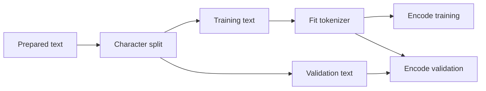

# Corpus, Splits, and Tokenization

## Corpus identity and split

Encoding, line endings, cleanup, ordering, duplication, and source selection change the empirical
distribution. smaLLM normalizes line endings, strips trailing whitespace, collapses repeated blank
lines, and ensures one final newline. A manifest records raw and prepared SHA-256 hashes, counts,
split policy, and normalization rules so a run identifies bytes rather than a mutable filename.

For split fraction \(\alpha\) and `C` characters, \(s=\lfloor\alpha C\rfloor\). Training receives
`text[:s]`, validation `text[s:]`. A chronological split can expose distribution shift across the
source; unlike randomized windows, it does not scatter near-duplicate neighboring contexts across
both partitions.

## Character tokenizer

Sorted training characters form a deterministic vocabulary. New artifacts reserve `<unk>` for an
unseen validation or prompt character. Although its diagnostic rendering has five glyphs, it
represents one source character for coverage accounting. Character models are inspectable and
lossless on known characters, but sequences are long and word structure must be learned across
many steps.

## Educational BPE

Begin with characters. Count adjacent pairs, choose the most frequent pair \((a,b)\), replace
non-overlapping occurrences by \(ab\), and append the merge rule. Repeat until the vocabulary cap
or minimum frequency stops training. For `a b a b a b`, merging `(a,b)` yields `ab ab ab`.
Encoding replays merges in learned order.

This implementation is deterministic through lexicographic tie-breaking but intentionally lacks
production pre-tokenization, byte fallback, normalization models, and optimized merge lookup.

## Leakage boundary

Tokenizer fitting is learned preprocessing. A BPE merge learned from validation frequency leaks
held-out statistics. The valid flow is:

If character length is \(C_s\) and token length \(T_s\), compression is \(C_s/T_s\). Shorter
sequences reduce attention work, roughly quadratic in `T`, but fixed token context then covers
more characters. Tokenization comparisons must disclose this compute/context coupling.

Implementation: [`corpus.py`](../src/smallm/data/corpus.py),
[`tokenizer.py`](../src/smallm/data/tokenizer.py), and
[`bpe_tokenizer.py`](../src/smallm/data/bpe_tokenizer.py).

Verification: a pair occurring only in validation must never appear in learned merges.
