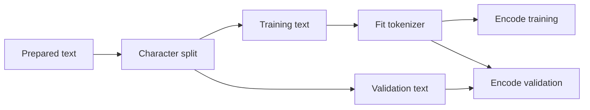

# Corpus, Splits, and Tokenization

## Corpus identity and split

Encoding, line endings, cleanup, ordering, duplication, and source selection change the empirical
distribution. smaLLM normalizes line endings, strips trailing whitespace, collapses repeated blank
lines, and ensures one final newline. A manifest records raw and prepared SHA-256 hashes, counts,
split policy, and normalization rules so a run identifies bytes rather than a mutable filename.

For split fraction \(\alpha\) and `C` characters, \(s=\lfloor\alpha C\rfloor\). Training receives
`text[:s]`, validation `text[s:]`. A chronological split can expose distribution shift across the
source; unlike randomized windows, it does not scatter near-duplicate neighboring contexts across
both partitions.

## Character tokenizer

Sorted training characters form a deterministic vocabulary. New artifacts reserve `<unk>` for an
unseen validation or prompt character. Although its diagnostic rendering has five glyphs, it
represents one source character for coverage accounting. Character models are inspectable and
lossless on known characters, but sequences are long and word structure must be learned across
many steps.

## Educational BPE

Begin with characters. Count adjacent pairs, choose the most frequent pair \((a,b)\), replace
non-overlapping occurrences by \(ab\), and append the merge rule. Repeat until the vocabulary cap
or minimum frequency stops training. For `a b a b a b`, merging `(a,b)` yields `ab ab ab`.
Encoding replays merges in learned order.

This implementation is deterministic through lexicographic tie-breaking but intentionally lacks
production pre-tokenization, byte fallback, normalization models, and optimized merge lookup.

## Boundary-aware byte BPE

The newer tokenizer starts from the complete byte alphabet

\[
\mathcal V_0=\{00,01,\ldots,\mathrm{ff}\},\qquad |\mathcal V_0|=256,
\]

so every UTF-8 string has a lossless representation without an unknown token. A requested
vocabulary below 256 is therefore mathematically impossible. Training partitions text into maximal
whitespace and non-whitespace segments, counts pairs only inside a segment, and applies each merge
inside the same segmentation during encoding. Thus a learned symbol may represent a word fragment
or a whitespace run, but never a word-plus-separator shortcut. This boundary policy reduces
corpus-specific phrase memorization while retaining subword compression.

UTF-8 makes character-normalized evaluation subtle. A Unicode scalar may occupy one to four bytes,
and a token may contain several scalars or end halfway through none during arbitrary slicing. During
encoding, smaLLM attaches a completion indicator to every byte—zero except on the final byte of a
scalar—and sums these indicators when bytes merge. If token (z_i) carries count (c_i), exact
evaluated characters are

\[
C_{\mathrm{eval}}=\sum_{i\in\mathcal I_{\mathrm{targets}}}c_i,
\qquad
\operatorname{BPC}=\frac{\sum_i -\log p(z_i\mid z_{<i})}{C_{\mathrm{eval}}\log 2}.
\]

This aligned count avoids both `len(decoded_token)` errors at multibyte boundaries and the false
assumption that bytes equal characters. As with every autoregressive evaluation here, token zero is
free context. If it ends inside the first Unicode scalar, that scalar is excluded from the target
denominator when its completion byte arrives; otherwise a partly supplied character would be counted
as fully predicted. Generated arbitrary byte sequences decode with replacement characters because
model output need not form valid UTF-8; text encoded by the tokenizer always round-trips exactly.

## Leakage boundary

Tokenizer fitting is learned preprocessing. A BPE merge learned from validation frequency leaks
held-out statistics. The valid flow is:

If character length is \(C_s\) and token length \(T_s\), compression is \(C_s/T_s\). Shorter
sequences reduce attention work, roughly quadratic in `T`, but fixed token context then covers
more characters. Tokenization comparisons must disclose this compute/context coupling.

Implementation: [`corpus.py`](../src/smallm/data/corpus.py),
[`tokenizer.py`](../src/smallm/data/tokenizer.py), and
[`bpe_tokenizer.py`](../src/smallm/data/bpe_tokenizer.py), and
[`byte_bpe_tokenizer.py`](../src/smallm/data/byte_bpe_tokenizer.py).

Verification: a pair occurring only in validation must never appear in learned merges.
