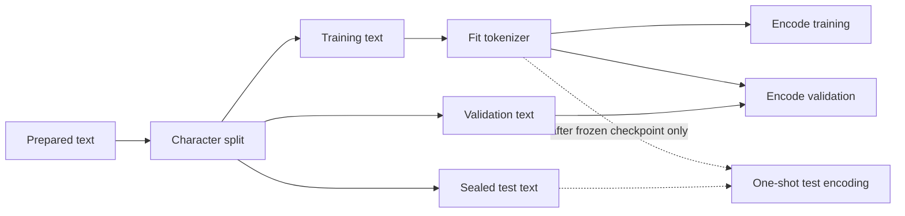

# 04 — From Text to Training Examples

Neural networks operate on numbers, not Python strings. Before the model can run, the data path
must identify the exact corpus, assign distinct roles to its regions, map text to integer token
IDs, and turn those IDs into aligned input/target examples. These choices are part of the model's
statistical contract, not clerical preprocessing.

## Formal data objects

Let \(\Sigma\) be the set of Unicode scalar values and \(\Sigma^*\) the set of finite Unicode
strings. A raw corpus is an ordered string \(r\in\Sigma^*\) plus source metadata. Preparation is a
deterministic map

\[
N:\Sigma^*\to\Sigma^*,\qquad c=N(r),
\]

where the prepared corpus \(c=(c_0,\ldots,c_{C-1})\) has length \(C=|c|\). A SHA-256 digest is an
external identity check on the serialized bytes, not a mathematical feature supplied to the model.

For \(\alpha,\beta\in(0,1)\) with \(\alpha+\beta<1\), let

\[
s=\lfloor\alpha C\rfloor,\qquad v=\lfloor(\alpha+\beta)C\rfloor.
\]

The ordered partition is

\[
c_{train}=c_{0:s},\qquad c_{val}=c_{s:v},\qquad c_{test}=c_{v:C}.
\]

The substrings are disjoint and concatenate back to \(c\). Their permitted statistical roles,
rather than their character types, distinguish them.

## Corpus identity and split

Encoding, line endings, cleanup, ordering, duplication, and source selection change the empirical
distribution. smaLLM normalizes line endings, strips trailing whitespace, collapses repeated blank
lines, and ensures one final newline. A manifest records raw and prepared SHA-256 hashes, counts,
split policy, and normalization rules so a run identifies bytes rather than a mutable filename.

For training fraction \(\alpha\), optional validation fraction \(\beta\), and \(C\) characters,
the boundaries are \(s=\lfloor\alpha C\rfloor\) and
\(v=\lfloor(\alpha+\beta)C\rfloor\). Training receives `text[:s]`, validation `text[s:v]`, and
test `text[v:]`. Without \(\beta\), legacy configs use `text[s:]` entirely for validation. A
chronological split can expose distribution shift across the source; unlike randomized windows, it
does not scatter near-duplicate neighboring contexts across partitions.

## Character tokenizer

Sorted training characters form a deterministic vocabulary. New artifacts reserve `<unk>` for an
unseen validation or prompt character. Although its diagnostic rendering has five glyphs, it
represents one source character for coverage accounting. Character models are inspectable and
lossless on known characters, but sequences are long and word structure must be learned across
many steps.

For training text `cab`, smaLLM builds `['a', 'b', 'c', '<unk>']`, making
`cab -> [2, 0, 1]`. An embedding table later uses each integer as a row index. The ordering does
not mean `c` is greater than `a`; token IDs are categorical names, not measured quantities.

A fitted tokenizer consists of functions

\[
E:\Sigma^*\to\mathcal V^*,\qquad D:\mathcal V^*\to\Sigma^*,
\]

where \(\mathcal V=[V]\). It is lossless on \(S\subseteq\Sigma^*\) when

\[
\forall s\in S,\qquad D(E(s))=s.
\]

The character tokenizer is lossless on strings composed of fitted characters. An unseen character
maps to `<unk>`, so exact recovery is intentionally impossible outside that alphabet. ByteBPE is
lossless for every valid UTF-8 string because all 256 byte values belong to its base vocabulary.

## Educational BPE

Begin with characters. Count adjacent pairs, choose the most frequent pair \((a,b)\), replace
non-overlapping occurrences by \(ab\), and append the merge rule. Repeat until the vocabulary cap
or minimum frequency stops training. For `a b a b a b`, merging `(a,b)` yields `ab ab ab`.
Encoding replays merges in learned order.

For current token sequence \(z=(z_0,\ldots,z_{m-1})\), define pair frequency

\[
n_z(a,b)=\sum_{i=0}^{m-2}\mathbf1[z_i=a\land z_{i+1}=b].
\]

One iteration chooses a maximizing pair under deterministic tie-breaking, introduces a symbol for
its concatenation, and replaces non-overlapping occurrences from left to right. Encoding is
therefore an ordered algorithm over learned merge rules, not an unordered dictionary lookup.

This implementation is deterministic through lexicographic tie-breaking but intentionally lacks
production pre-tokenization, byte fallback, normalization models, and optimized merge lookup.

## Boundary-aware byte BPE

The newer tokenizer starts from the complete byte alphabet

\[
\mathcal V_0=\{00,01,\ldots,\mathrm{ff}\},\qquad |\mathcal V_0|=256,
\]

so every UTF-8 string has a lossless representation without an unknown token. A requested
vocabulary below 256 is therefore mathematically impossible. Training partitions text into maximal
whitespace and non-whitespace segments, counts pairs only inside a segment, and applies each merge
inside the same segmentation during encoding. Thus a learned symbol may represent a word fragment
or a whitespace run, but never a word-plus-separator shortcut. This boundary policy reduces
corpus-specific phrase memorization while retaining subword compression.

UTF-8 makes character-normalized evaluation subtle. A Unicode scalar may occupy one to four bytes,
and a token may contain several scalars or end halfway through none during arbitrary slicing. During
encoding, smaLLM attaches a completion indicator to every byte—zero except on the final byte of a
scalar—and sums these indicators when bytes merge. If token \(z_i\) carries count \(c_i\), exact
evaluated characters are

\[
C_{\mathrm{eval}}=\sum_{i\in\mathcal I_{\mathrm{targets}}}c_i,
\qquad
\operatorname{BPC}=\frac{\sum_i -\log p(z_i\mid z_{<i})}{C_{\mathrm{eval}}\log 2}.
\]

This aligned count avoids both `len(decoded_token)` errors at multibyte boundaries and the false
assumption that bytes equal characters. As with every autoregressive evaluation here, token zero is
free context. If it ends inside the first Unicode scalar, that scalar is excluded from the target
denominator when its completion byte arrives; otherwise a partly supplied character would be counted
as fully predicted. Generated arbitrary byte sequences decode with replacement characters because
model output need not form valid UTF-8; text encoded by the tokenizer always round-trips exactly.

## Leakage boundary

Tokenizer fitting is learned preprocessing. A BPE merge learned from validation frequency leaks
held-out statistics. The valid flow is:



If character length is \(C_s\) and token length \(T_s\), compression is \(C_s/T_s\). Shorter
sequences reduce attention work, roughly quadratic in `T`, but fixed token context then covers
more characters. Tokenization comparisons must disclose this compute/context coupling.

## Shifted token blocks

Given token IDs `[10, 20, 30, 40, 50]` and `block_size=3`, the first example is:

```text
input  x = [10, 20, 30]
target y = [20, 30, 40]
```

Target position zero asks what follows `10`; target position two asks what follows the prefix
`10,20,30`. The next starting index gives `[20,30,40] -> [30,40,50]`. Training uses these
stride-one windows to expose varied contexts.

[`TokenBlockDataset`](../src/smallm/data/dataset.py) takes one slice of `block_size + 1` tokens and
returns the slice without its last token and without its first token. Its length is
`number_of_tokens - block_size`, the number of complete shifted windows. A block needs one more raw
token than input positions because the last input still needs a next-token target.

For token stream \(z=(z_0,\ldots,z_{N-1})\) and context length \(T<N\), define

\[
\mathcal D_T(z):[N-T]\to\mathcal V^T\times\mathcal V^T,
\qquad
i\mapsto\left(z_{i:i+T},\ z_{i+1:i+T+1}\right).
\]

The domain has \(N-T\) indices even when two windows contain identical values; a dataset is an
indexed family rather than a mathematical set that discards duplicates. Every input and target lies
in \(\mathcal V^T\). For aligned
positions before the block end, \(y_t=x_{t+1}\); the final target is supplied by the one-token
extension beyond `x`.

Validation instead traverses non-overlapping target regions so duplicated overlapping contexts do
not receive extra weight. Chapter 08 derives that estimate.

## Split text before fitting the tokenizer

smaLLM splits normalized Unicode text first, then fits the tokenizer on training text only.
Splitting an already-tokenized stream can move the character boundary because tokens span different
lengths. Fitting BPE before splitting leaks held-out pair frequencies.

The terminal test text is not encoded during training. Recording its character count does not
reveal token identities or likelihood; a separate evaluator accesses it after checkpoint selection.

Implementation: [`corpus.py`](../src/smallm/data/corpus.py),
[`tokenizer.py`](../src/smallm/data/tokenizer.py), and
[`bpe_tokenizer.py`](../src/smallm/data/bpe_tokenizer.py), and
[`byte_bpe_tokenizer.py`](../src/smallm/data/byte_bpe_tokenizer.py).

Verification: a pair occurring only in validation must never appear in learned merges.

## Chapter checkpoint

1. Why are token IDs categorical names rather than scalar measurements?
2. For six token IDs and `block_size=4`, write the first input and target and state dataset length.
3. Why must the character split occur before BPE fitting?
4. What changes computationally when one tokenizer compresses the same text more strongly?
5. Why can UTF-8 character accounting differ from byte counting?

Next: [Neural networks and autograd](05-neural-networks-and-autograd.md).
