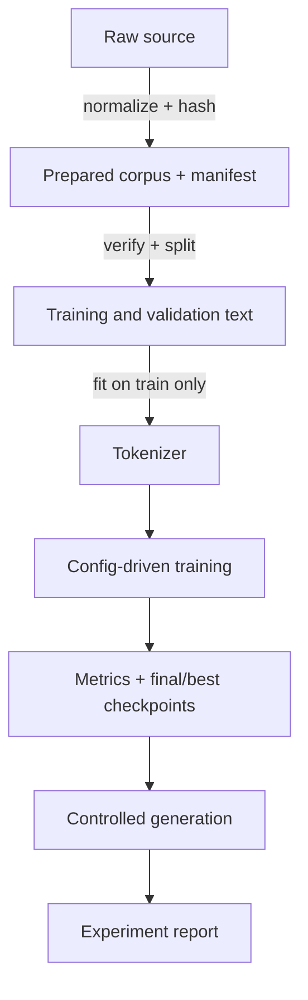

# Reproducibility, Artifacts, Security, and Experiment Design

## Evidence chain

A professional result is a chain of identities and transformations. A filename is not provenance;
a checksum is. A config is not enough if package versions or preprocessing code differ. A sample
is not evidence unless decoding controls and checkpoint identity are known.

## Artifact contracts

Each completed run contains a config snapshot, JSONL metrics, summary, final checkpoint, optional
best checkpoint, sample, and copied manifest. Schema versions permit additive evolution and make
incompatible interpretation explicit. Legacy readers accept older character tokenizers; new
writers include an unknown token and schema number.

Atomic writes serialize to a sibling temporary file, flush it, and replace the destination. This
prevents readers from observing a partially written checkpoint or JSON document. A run becomes
discoverable only once `summary.json` exists, so a failed orchestration cannot become `latest`.

## Trust boundaries

Python pickle can execute constructors during deserialization. PyTorch checkpoints are therefore
loaded with `weights_only=True` and validated as mappings containing model state and model config.
This narrows, but does not erase, the artifact trust boundary. Corpora can contain private text;
samples may memorize fragments; paths and manifests can point at local data. Runtime artifacts
remain ignored and must not be attached casually to issues.

## Controlled experiments

A useful report states hypothesis, independent variable, controls, corpus identity, seeds,
commands, quantitative outputs, qualitative samples, limitations, and a conclusion proportional
to evidence. Multiple comparisons on one validation set gradually overfit researcher decisions.
The test set, if introduced, should remain sealed until a final choice is made.

Experiments 016–017 fitted tokenizers on full text and derived BPC from prefix loss with whole-set
counts. Their raw observations remain historical, but corrected metrics supersede their headline
interpretation. This is not an embarrassment: preserving an erratum is stronger scientific
behavior than silently rewriting evidence.

## Project boundaries

smaLLM intentionally omits distributed training, mixed precision, resume state, production
tokenizers, model families, and remote tracking. Adding them is justified only when a concrete
experiment or reliability contract needs them. Small, inspectable boundaries are a design feature.

Implementation: [`artifacts.py`](../src/smallm/training/artifacts.py),
[`checkpoints.py`](../src/smallm/training/checkpoints.py), and
[`runs.py`](../src/smallm/training/runs.py).

Checks: reconstruct a result from its summary; identify which failures occur before any run
directory exists; explain why old and corrected BPC values cannot be compared as one series.
### Seed ensembles and descriptive uncertainty

A random seed fixes initialization, minibatch order, dropout masks, and sampling streams; it is an
experimental condition, not a hyperparameter to optimize. For preregistered seeds
(s_1,\ldots,s_n) and metric (x_i), report every observation plus

\[
\bar{x}=\frac1n\sum_{i=1}^n x_i,
\qquad
\sigma_{\mathrm{pop}}=\sqrt{\frac1n\sum_{i=1}^n(x_i-\bar{x})^2}.
\]

smaLLM uses population standard deviation because the report describes the complete, explicitly
chosen seed set; it does not pretend three seeds estimate a universal sampling distribution. The
minimum and maximum expose asymmetry that a mean and deviation can hide. Stop step is itself a
random outcome under early stopping and must be summarized alongside model quality.

Never discard a completed seed because it weakens the conclusion, and never report the best seed as
the expected result. A hyperparameter difference much smaller than seed-to-seed spread is not robust
evidence. Decoding randomness is held fixed when comparing training seeds so observed generation
variation comes from model training rather than a second uncontrolled random stream.

### External validity and corpus-by-seed interactions

A random split of one book estimates performance on held-out text from essentially the same source;
it does not establish robustness to a new author, style, vocabulary, or document structure. A new
book changes the empirical distribution \(P_C(X)\), so a tokenizer comparison can be modeled as

\[
y_{tcs}=\mu+\alpha_t+\beta_c+(\alpha\beta)_{tc}+u_s+\varepsilon_{tcs},
\]

where \(t\) is tokenizer, \(c\) corpus, \(s\) seed, \(\alpha_t\) is the tokenizer effect,
\(\beta_c\) is corpus difficulty, \((\alpha\beta)_{tc}\) is the tokenizer-by-corpus interaction,
and \(u_s\) captures training randomness. One seed on a second corpus observes a cell but cannot
separate interaction from seed noise. A balanced corpus-by-seed matrix can.

Matching corpus length controls the amount of text, not its entropy, lexical diversity, boundary
statistics, or chronological-tail difficulty. Matching token context also requires converting to
characters:

\[
L_{\mathrm{chars}}=L_{\mathrm{tokens}}\frac{N_{\mathrm{train\ chars}}}{N_{\mathrm{train\ tokens}}}.
\]

This is an average receptive-field proxy; individual ByteBPE sequences still vary in character
length. BPC makes held-out likelihood comparable across lossless tokenizers,

\[
\operatorname{BPC}=\frac{-\log_2 p(x_{1:n})}{n},
\]

but comparable metrics do not remove design confounds such as vocabulary-dependent parameter
counts or checkpoint selection on the same validation tail.

External-validity claims should therefore form a ladder: same split across seeds; deterministic
alternative splits; a second source; multiple source families; finally, a sealed test distribution.
Each rung supports a wider claim, and none licenses the next one automatically. Milestone 024
reached the second-source rung with one seed. Milestone 025 fills a balanced 2 × 2 × 3 matrix and
observes a negative ByteBPE512-minus-character contrast in every same-seed pair. Its positive
corpus interaction shows why a replicated direction is not a universal effect size: Peter Pan
attenuates the advantage even though it does not reverse it.

For paired seeds, define

\[
d_{cs}=y_{\mathrm{Byte},c,s}-y_{\mathrm{char},c,s},
\qquad
I_s=d_{\mathrm{PeterPan},s}-d_{\mathrm{Alice},s}.
\]

Pairing subtracts seed-specific difficulty shared by both tokenizers within a corpus. The
difference-in-differences \(I_s\) measures how much the tokenizer contrast changes between corpora.
It is descriptive here: three seeds and two related books do not justify asymptotic inference, and
the paired observations are not mutually independent across corpus because a seed is reused.

### Validation selection and a sealed test set

Early stopping chooses

\[
\hat{k}=\arg\min_{k\in\mathcal{K}}\widehat{L}_{\mathrm{val}}(\theta_k),
\]

so the reported validation minimum is an order statistic selected from repeated looks. Even when
each evaluation is unbiased for a fixed checkpoint, the minimum is optimistically biased as an
estimate of future performance. Reusing the same validation tail to choose tokenizers, context,
regularization, and follow-up questions compounds researcher degrees of freedom.

A three-way split separates roles: training fits parameters and tokenizer merges; validation drives
early stopping and configuration choice; a sealed test segment is read once after the decision rule
is frozen. For chronological text, the ordering must remain explicit because a terminal test block
measures forward generalization, not exchangeable random-split performance. Test metrics must never
flow back into checkpoint choice, hyperparameter tuning, or seed selection.
