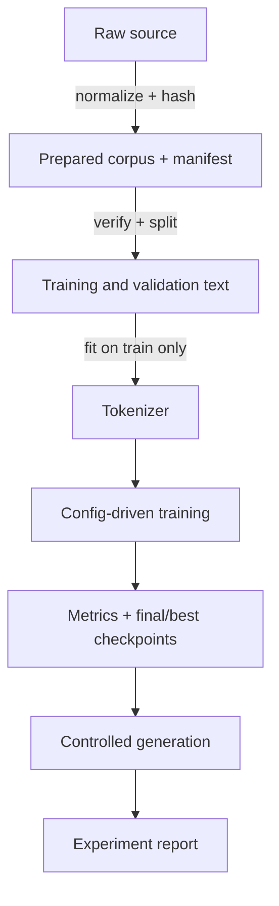

# Reproducibility, Artifacts, Security, and Experiment Design

## Evidence chain

A professional result is a chain of identities and transformations. A filename is not provenance;
a checksum is. A config is not enough if package versions or preprocessing code differ. A sample
is not evidence unless decoding controls and checkpoint identity are known.

## Artifact contracts

Each completed run contains a config snapshot, JSONL metrics, summary, final checkpoint, optional
best checkpoint, sample, and copied manifest. Schema versions permit additive evolution and make
incompatible interpretation explicit. Legacy readers accept older character tokenizers; new
writers include an unknown token and schema number.

Atomic writes serialize to a sibling temporary file, flush it, and replace the destination. This
prevents readers from observing a partially written checkpoint or JSON document. A run becomes
discoverable only once `summary.json` exists, so a failed orchestration cannot become `latest`.

## Trust boundaries

Python pickle can execute constructors during deserialization. PyTorch checkpoints are therefore
loaded with `weights_only=True` and validated as mappings containing model state and model config.
This narrows, but does not erase, the artifact trust boundary. Corpora can contain private text;
samples may memorize fragments; paths and manifests can point at local data. Runtime artifacts
remain ignored and must not be attached casually to issues.

## Controlled experiments

A useful report states hypothesis, independent variable, controls, corpus identity, seeds,
commands, quantitative outputs, qualitative samples, limitations, and a conclusion proportional
to evidence. Multiple comparisons on one validation set gradually overfit researcher decisions.
The test set, if introduced, should remain sealed until a final choice is made.

Experiments 016–017 fitted tokenizers on full text and derived BPC from prefix loss with whole-set
counts. Their raw observations remain historical, but corrected metrics supersede their headline
interpretation. This is not an embarrassment: preserving an erratum is stronger scientific
behavior than silently rewriting evidence.

## Project boundaries

smaLLM intentionally omits distributed training, mixed precision, resume state, production
tokenizers, model families, and remote tracking. Adding them is justified only when a concrete
experiment or reliability contract needs them. Small, inspectable boundaries are a design feature.

Implementation: [`artifacts.py`](../src/smallm/training/artifacts.py),
[`checkpoints.py`](../src/smallm/training/checkpoints.py), and
[`runs.py`](../src/smallm/training/runs.py).

Checks: reconstruct a result from its summary; identify which failures occur before any run
directory exists; explain why old and corrected BPC values cannot be compared as one series.
