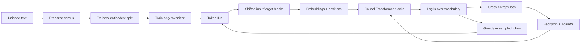

# smaLLM: Transformers From Zero to Source Code

This is a self-contained learning path through the ideas implemented in smaLLM. It assumes you can
read basic Python—variables, functions, loops, and classes—but assumes **no linear algebra,
calculus, probability, machine learning, PyTorch, or Transformer knowledge**. Every mathematical
tool is introduced when it becomes useful.

The destination is precise: you should be able to open the model, point to every tensor operation,
state its shape, explain why it exists, and trace how a text character can influence a training
loss, a weight update, and a generated token. The handbook goes as deep as this repository goes. It
does not pretend smaLLM implements production-scale systems that it deliberately omits.

## How to Study This Handbook

Read in order. Do not try to memorize equations on the first pass. For each new idea, use four
passes:

1. **Meaning:** say what problem the idea solves in ordinary language.
2. **Mechanics:** work the smallest numerical example by hand.
3. **Shapes:** annotate every tensor with its dimensions.
4. **Code:** find the exact operation in `src/smallm/` and run the chapter checks.

Each technical chapter now has two synchronized layers: an intuitive account and a formal account
that states domains, indices, assumptions, and derivations. The intuitive layer motivates the
object; the formal layer is the contract. When they seem to disagree, stop and resolve the symbol
or shape rather than choosing whichever explanation feels easier.

The “checkpoint” at the end of each chapter is a mastery test, not trivia. If you cannot answer it
without repeating a sentence from the page, revisit the worked example.

Begin with the required [minimum glossary](00-glossary.md). Later chapters use terms
such as *corpus*, *token*, *context*, *logit*, and *checkpoint* in those precise senses.

## Learning Path

| Chapter | Question answered | Code destination |
| --- | --- | --- |
| [00 — Minimum glossary](00-glossary.md) | What do the critical data, model, Transformer, and evidence terms mean? | Vocabulary used everywhere |
| [01 — Start here](01-start-here.md) | What is this project teaching, and how do I run it safely? | Whole repository |
| [02 — Computation and tensors](02-computation-and-tensors.md) | What are scalars, vectors, matrices, tensors, shapes, and matrix multiplication? | PyTorch operations everywhere |
| [03 — Probability and language modeling](03-language-modeling.md) | How can “predict the next token” become a mathematical objective? | `GPT.forward` loss |
| [04 — From text to examples](04-data-tokenization-datasets.md) | How does text become token IDs, inputs, and targets without leakage? | `smallm.data` |
| [05 — Neural networks and autograd](05-neural-networks-and-autograd.md) | How do learned weights, gradients, and backpropagation work? | `nn.Module`, `loss.backward()` |
| [06 — Attention from scratch](06-attention.md) | How can each position retrieve useful information from its allowed past? | `CausalSelfAttention` |
| [07 — The complete Transformer](07-transformer.md) | How do embeddings, attention, MLPs, residuals, and normalization form GPT? | `smallm.model` |
| [08 — Training](08-training.md) | How does repeated prediction error change the weights responsibly? | `smallm.training` |
| [09 — Evaluation and generation](09-evaluation-generation.md) | How do we measure predictions and turn them into text? | `smallm.evaluation`, `generation` |
| [10 — Reproducible experiments](10-reproducibility.md) | When does a result count as evidence rather than an anecdote? | Artifacts and reports |
| [11 — End-to-end code walkthrough](11-code-walkthrough.md) | Can I trace one batch through the exact repository? | Complete runtime path |
| [12 — Reference](12-reference.md) | Where are the symbols, glossary, derivations, and sources? | Quick lookup |

## The Whole System in One Picture

## Shape Language Used Throughout

- `B`: number of sequences processed together (batch size)
- `T`: tokens in each current sequence (sequence length)
- `C`: numbers used to represent each token (embedding width)
- `H`: attention heads
- `D = C / H`: numbers per head
- `V`: possible token IDs (vocabulary size)

Tensors are batch-first. A hidden-state tensor shaped `(B, T, C)` means: for each sequence, for
each token position, store `C` learned features. `log` means natural logarithm unless stated
otherwise.

The formal convention is defined in [chapter 12](12-reference.md): `[n]={0,…,n-1}`, bold-free
uppercase letters usually denote tensors, lowercase indexed letters denote entries, and every sum
states or implies its index set.

## Honest Scope

Finishing this path means understanding a small decoder-only GPT deeply. It does not by itself
teach distributed training, mixture-of-experts models, retrieval, instruction tuning, RLHF,
production inference, or frontier-model safety. Those are later subjects built on the foundation
made explicit here.
