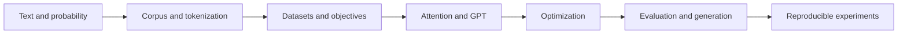

# smaLLM Theory and Systems Handbook

This handbook explains the complete path from text to a controlled language-model experiment. It
assumes linear algebra, calculus, probability, and basic PyTorch. Commands live in
[`docs/`](../docs/); observations live in [`experiments/`](../experiments/); these notes explain
the mathematics, implementation, and evidence boundaries.

1. [Language modeling foundations](01-language-modeling.md)
2. [Corpus, splits, and tokenization](02-data-and-tokenization.md)
3. [Datasets and the Transformer](03-transformer.md)
4. [Optimization and training dynamics](04-training.md)
5. [Evaluation and generation](05-evaluation-and-generation.md)
6. [Reproducibility, artifacts, and experiment design](06-reproducibility.md)
7. [Notation, glossary, and references](07-appendix.md)

Shape convention: `B` batch, `T` sequence length, `C` embedding width, `H` heads, `D=C/H`
head width, and `V` vocabulary. Tensors are batch-first. `log` is natural unless marked otherwise.

Each chapter defines its symbols, derives the relevant equations, maps them to implementation,
names failure modes, and ends with questions that can falsify a shallow understanding.
